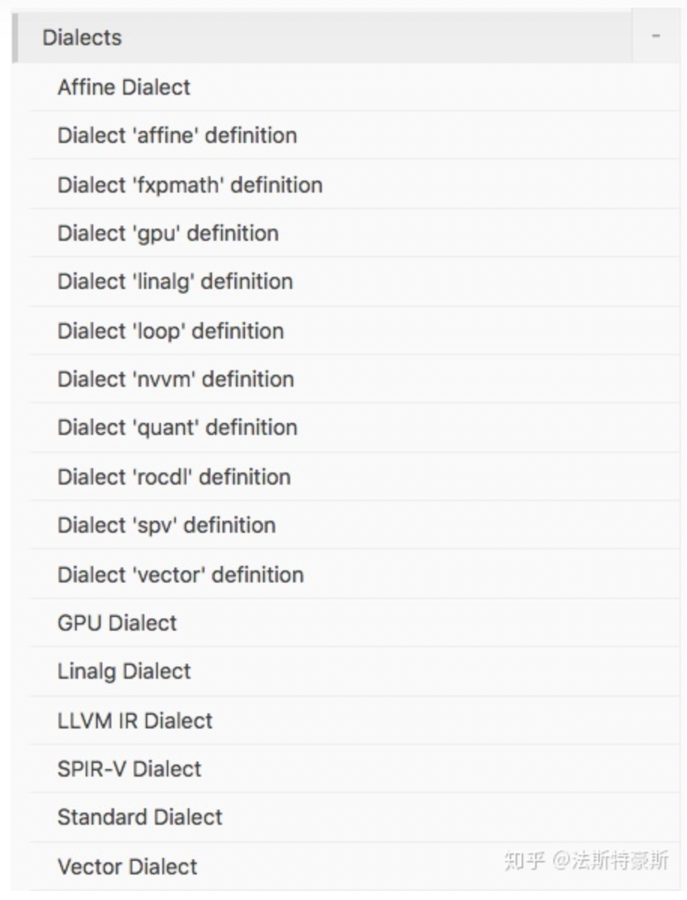
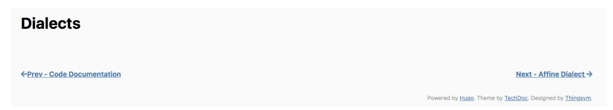
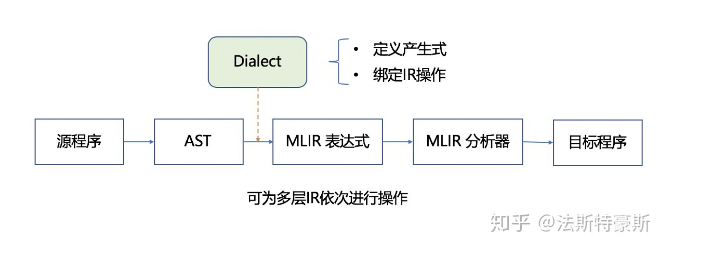

# MLIR的法宝：Dialects
    上一篇文章讲到当前的编译结构的问题在于各种IR之间转换的效率和可迁移性不高。
    MLIR试图使用一种一致性强的方式，为各种DSL提供一种中间表达形式，将他们集
    成为一套生态系统，编译到特定硬件平台的汇编语言上。这样的目标是通过什么手
    段实现的呢？

## IR群雄割据，MLIR统一天下

从源程序到目标程序，要经过一系列的抽象以及分析，通过Lowering Pass来实现从一个IR到另一个IR的转换，这样的过程中会存在有些操作重复实现的情况，也就导致了转换效率低的问题。这就好比，IR们组成一个流水线要合起伙来干一个大买卖，但是互相配合不默契，谁也明白不了对方究竟干了啥，为了保险起见，每个IR拿到上一个IR的产品之后只能多干点活保证不出错，这样一来效率自然就低了。MLIR面对这种IR群雄割据的现状，打算一统天下！打天下容易，守天下难呀，不让我们用各种IR了，你倒是给我们一条活路呀，怎么才能让源语言变成汇编语言然后跑在机器上呀？于是，统一IR的第一步就是要统一“语言”，各个IR原来配合不默契，谁也理解不了谁，就是因为“语言”不通，没法用统一的“语言”指挥流水线干活。MLIR看准时机拿出了自己的法宝：Dialects！让各个IR学习Dialects这个“语言”，这样以来，不光能指挥流水线高效干活了，还能随意扩展更改分工，从此IR们过上了幸福美满的生活。

## Dialects是个啥，为啥这么厉害
IR们是过上了幸福美满的生活，但是这个法宝到底是怎么大显神通的呢？此刻小小地吐槽一下MLIR文档的设计，整个的文档结构逻辑不是十分清晰，也没有一个学习路径，文档的顺序是按照字母表顺序排列的。对于Dialects没有一个概括性的介绍和扩展的教程，只是罗列了一系列已有的Dialect：

然而，一级大标题Dialects的内容却为空：

于是，我翻了一些文档简单总结了一下Dialects的作用。在我看来，Dialects是将所有的IR放在了同一个命名空间中，分别对每个IR定义对应的产生式以及绑定相应的操作，从而生成一个MLIR的模型。整个的编译过程，从源语言生成AST，借助Dialects遍历AST，产生MLIR的表达式，此处可为多层IR通过Lowering Pass依次进行分析，最后经过MLIR分析器，生成目标语言。

上述编译流程的分析，基于对官方给出的[Toy项目](https://mlir.llvm.org/docs/Tutorials/Toy/)的总结，以及各个[Dialects](https://mlir.llvm.org/docs/Dialects/)的总结得出，如有错误纰漏，欢迎大家批评指正。学习MLIR的过程，苦于没有一个合适的学习路径，我认为官方的文档有些杂乱，逻辑性不强，大家如果有好的学习方法或者学习路径，求推荐一波！后续将会进行官方给出的Toy项目的实践，毕竟纸上谈兵真谈不太明白，实践出真知！