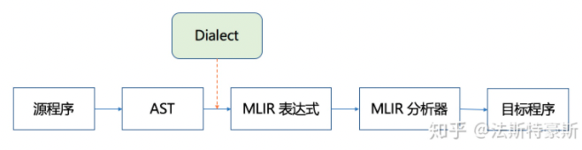
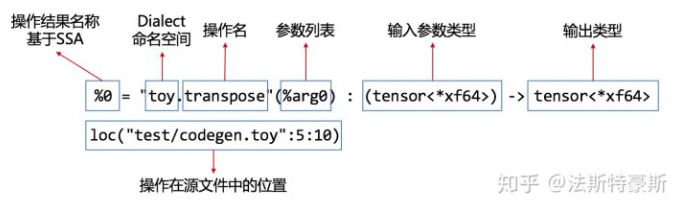

# MLIR的惊鸿一瞥
    上一篇文章提到，MLIR之所以有统一IR的能力，凭的就是Dialects的功力。Dialects将各种源
    语言转变成统一形式的IR格式，让IR之间能够更好的协作扩展。那么，MLIR究竟长什么样子呢，我
    们下面通过MLIR官方给的Toy语言的例子来简单展示一下。

上回的故事讲到MLIR希望统一所有用一种“语言”统一所有IR。那么在开疆扩土之前，起码开个动员会，讲讲中心思想，究竟是想把这些IR统一成什么样子呀。我们得先心里有个数，再决定要不要撸起袖子一起干！下面就让我们来看看MLIR的惊鸿一瞥。

## MLIR的构建之路
第一步我们要构建MLIR，令我万万没想到的是，我竟然在一上来就踩了个毫无技术含量的坑，爬了一天才爬出来，原因在于没有看对构建的文档！发现真相的我真是喷出一口老血...在按照llvm-project库里的README尝试了一天，报了各种莫名奇妙的错之后，终于发现构建文档在MLIR官网的Getting Started处，前面文章我还吐槽过MLIR官网的一级目录都是空，看来真是错怪他了。

我的整个构建过程如下：

```shell
$ git clone https://github.com/llvm/llvm-project.git
$ mkdir llvm-project/build
$ cd llvm-project/build
$ cmake -G "Unix Makefiles" ../llvm \
    -DLLVM_ENABLE_PROJECTS=mlir \
    -DLLVM_BUILD_EXAMPLES=ON \
    -DLLVM_TARGETS_TO_BUILD="host" \
    -DCMAKE_BUILD_TYPE=Release \
    -DLLVM_ENABLE_ASSERTIONS=ON 
$ cmake --build . --target check-mlir
```

构建之后可以在 llvm-project/build/bin/ 路径下找到可执行文件。

## 生成MLIR表达式
本文下述部分使用官方给出的Toy语言demo的第二章来举例说明。

根据上一篇文章所述，整个MLIR的编译路径如下图所示：



首先要将源程序生成抽象语法树(AST)，然后再遍历抽象语法树来构建MLIR表达式。那么使用我们刚刚生成的可执行文件来打印出抽象语法树：

```shell
$ cd llvm-project/build/
$ bin/toyc-ch2 ../mlir/test/Examples/Toy/Ch2/codegen.toy -emit=mlir -mlir-print-debuginfo
```

对于Toy语言程序codegen.toy：

```
def multiply_transpose(a, b) {
  return transpose(a) * transpose(b);
}

def main() {
  var a<2, 3> = [[1, 2, 3], [4, 5, 6]];
  var b<2, 3> = [1, 2, 3, 4, 5, 6];
  var c = multiply_transpose(a, b);
  var d = multiply_transpose(b, a);
  print(d);
}
```

MLIR表达式如下所述：

```
module {
  func @multiply_transpose(%arg0: tensor<*xf64>, %arg1: tensor<*xf64>) -> tensor<*xf64> {
    %0 = "toy.transpose"(%arg0) : (tensor<*xf64>) -> tensor<*xf64> loc("test/codegen.toy":5:10)
    %1 = "toy.transpose"(%arg1) : (tensor<*xf64>) -> tensor<*xf64> loc("test/codegen.toy":5:25)
    %2 = "toy.mul"(%0, %1) : (tensor<*xf64>, tensor<*xf64>) -> tensor<*xf64> loc("test/codegen.toy":5:25)
    "toy.return"(%2) : (tensor<*xf64>) -> () loc("test/codegen.toy":5:3)
  } loc("test/codegen.toy":4:1)
  func @main() {
    %0 = "toy.constant"() {value = dense<[[1.000000e+00, 2.000000e+00, 3.000000e+00], [4.000000e+00, 5.000000e+00, 6.000000e+00]]> : tensor<2x3xf64>} : () -> tensor<2x3xf64> loc("test/codegen.toy":9:17)
    %1 = "toy.reshape"(%0) : (tensor<2x3xf64>) -> tensor<2x3xf64> loc("test/codegen.toy":9:3)
    %2 = "toy.constant"() {value = dense<[1.000000e+00, 2.000000e+00, 3.000000e+00, 4.000000e+00, 5.000000e+00, 6.000000e+00]> : tensor<6xf64>} : () -> tensor<6xf64> loc("test/codegen.toy":10:17)
    %3 = "toy.reshape"(%2) : (tensor<6xf64>) -> tensor<2x3xf64> loc("test/codegen.toy":10:3)
    %4 = "toy.generic_call"(%1, %3) {callee = @multiply_transpose} : (tensor<2x3xf64>, tensor<2x3xf64>) -> tensor<*xf64> loc("test/codegen.toy":11:11)
    %5 = "toy.generic_call"(%3, %1) {callee = @multiply_transpose} : (tensor<2x3xf64>, tensor<2x3xf64>) -> tensor<*xf64> loc("test/codegen.toy":12:11)
    "toy.print"(%5) : (tensor<*xf64>) -> () loc("test/codegen.toy":13:3)
    "toy.return"() : () -> () loc("test/codegen.toy":8:1)
  } loc("test/codegen.toy":8:1)
} loc("test/codegen.toy":0:0)
```

下面我们取其中的transpose(a)操作，来看看MLIR表达式是由什么组成的。transpose(a)的MLIR表达式由操作结果名称、Dialect命名空间、操作名、参数列表、输入参数类型、输出类型和操作在源文件中的位置组成。



到此为止，我们终于窥见了MLIR的惊鸿一瞥，下一步将会继续进行实践，看看MLIR表达式是怎么生成的，Dialects又在其中究竟发生了什么作用呢？

本文参考自MLIR官方文档Toy语言教程的[章节1](https://mlir.llvm.org/docs/Tutorials/Toy/Ch-1/)和[章节2](https://mlir.llvm.org/docs/Tutorials/Toy/Ch-2/)，如有错误纰漏，欢迎大家批评指正。