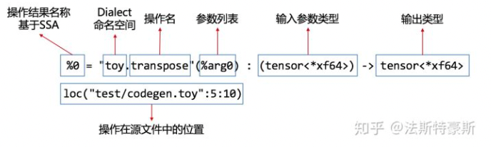
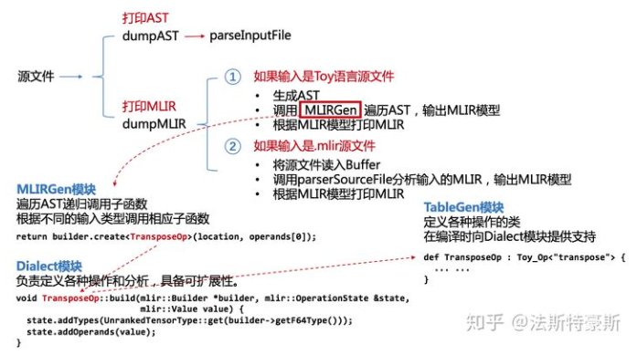

# MLIR的生产线--Dialects和他的小伙伴们
    上一篇文章我们看到了MLIR的样子，一个MLIR表达式包括操作结果名称、Dialect命名空间、操作名、参数列表、输入参数类型、输出类型和操作在源文件中的位置信息。生成这样的MLIR并非易事，我们需要各个模块的配合，其中包括Dialect模块、MLIRGen模块、TableGen模块。

我们在看到MLIR的惊鸿一瞥之后，已经可以肯定MLIR可读性很高，如果把各种IR统一为MLIR会大大增加效率。下面就是要撸起袖子加油干了！为了高效生成MLIR，我们要为MLIR构造一条自动化的生产线，于是我们找来了履带、机械臂和零件，开始组装！

下面我还是用上一篇文章提到过的transpose(a)的例子来介绍各个模块的功能和作用。案例来源于MLIR官方提供的Toy语言教程的[第二章](https://mlir.llvm.org/docs/Tutorials/Toy/Ch-2/)。



## MLIRGen模块 -- 生产线的履带
MLIRGen模块的作用就是遍历抽象语法树(AST)。transpose(a)的AST如下所示：

```
Call 'transpose' [ @../mlir/test/Examples/Toy/Ch2/codegen.toy:5:10
                   var: a @../mlir/test/Examples/Toy/Ch2/codegen.toy:5:20
                 ]

```

MLIRGen根据AST各节点的类型，递归调用子函数，子函数内部再根据不同情况，进行相应操作。对于transpose(a)来说，相应的子函数的输入为CallExprAST节点，MLIRGen模块要对其进行函数调用操作：

```cpp
mlir::Value mlirGen(CallExprAST &call) {
  llvm::StringRef callee = call.getCallee();
  auto location = loc(call.loc());

  // Codegen the operands first.
  SmallVector<mlir::Value, 4> operands;
  for (auto &expr : call.getArgs()) {
    auto arg = mlirGen(*expr);
    if (!arg)
      return nullptr;
    operands.push_back(arg);
  }

  // Builting calls have their custom operation, meaning this is a
  // straightforward emission.
  if (callee == "transpose") {
    if (call.getArgs().size() != 1) {
      emitError(location, "MLIR codegen encountered an error: toy.transpose "
                          "does not accept multiple arguments");
      return nullptr;
    }
    return builder.create<TransposeOp>(location, operands[0]);
  }

  // Otherwise this is a call to a user-defined function. Calls to ser-defined
  // functions are mapped to a custom call that takes the callee name as an
  // attribute.
  return builder.create<GenericCallOp>(location, callee, operands);
}
```

其中可以看出存在一个判断条件，如果函数名为transpose则要构造TransposeOp类型的MLIR节点。

## Dialect模块 -- 生产线的机械臂

在前面的文章中提到过Dialect是MLIR的法宝，Dialect模块负责定义各种操作和分析，同时还具备可扩展性。对于transpose(a)来说，Dialect模块负责给这个转置操作添加相应的类型和操作数的值。

```cpp
void TransposeOp::build(mlir::Builder *builder, mlir::OperationState &state,
                        mlir::Value value) {
  state.addTypes(UnrankedTensorType::get(builder->getF64Type()));
  state.addOperands(value);
}
```

看到这我便产生了疑问，我们把Dialect模块中的各种函数看作是流水线上的机械臂，那么零件从哪来呢。也就是说，我并没有发现TransposeOp这个类是从哪里定义的，在阅读文档和源代码后，我最终发现了，这个类的定义，是由Operation Definition Specification (ODS)框架提供的。

## TableGen模块 -- 生产线的零件

Operation Definition Specification (ODS)框架是基于TableGen规范构造的。在源代码中，TableGen模块就是负责这一部分的描述，它定义了各种操作的类。对于transpose(a)来说，我们需要TableGen模块中的Ops.td文件定义TransposeOp：

```
def TransposeOp : Toy_Op<"transpose"> {
  let summary = "transpose operation";

  let arguments = (ins F64Tensor:$input);
  let results = (outs F64Tensor);

  // Allow building a TransposeOp with from the input operand.
  let builders = [
    OpBuilder<"Builder *b, OperationState &state, Value input">
  ];

  // Invoke a static verify method to verify this transpose operation.
  let verifier = [{ return ::verify(*this); }];
}

```
TableGen模块在编译时向Dialect模块提供支持，关于ODS框架和TableGen的内容在下一篇文章将会详细介绍。

## MLIR生产线组装

在介绍完整条生产线的各个组成部分之后，下一步就是把他们组装到一起。



如上图所示，将各个模块组装在一起，就可以实现从源文件到MLIR的输出，各个模块各司其职，互相配合。对于MLIR生产线的实践，可以在编译构建完LLVM+MLIR之后，使用如下指令生成Toy语言教程的第二章的MLIR表达式。

```shell
$ cd llvm-project/build/
$ bin/toyc-ch2 ../mlir/test/Examples/Toy/Ch2/codegen.toy -emit=mlir -mlir-print-debuginfo
```

本文参考自MLIR官方文档Toy语言教程的[章节2](https://mlir.llvm.org/docs/Tutorials/Toy/Ch-2/)及其[源代码](https://github.com/llvm/llvm-project/tree/master/mlir/examples/toy/Ch2)，如有错误纰漏，欢迎大家批评指正。

