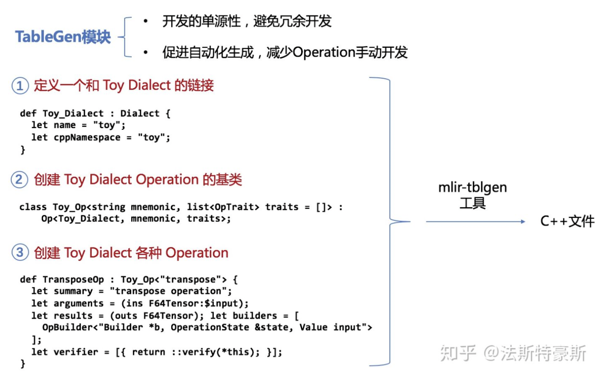
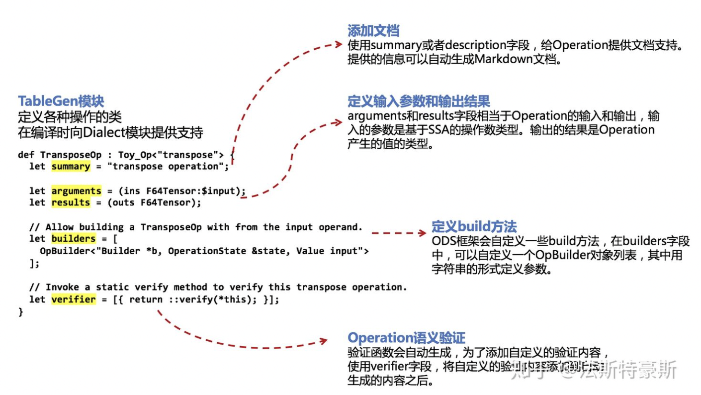
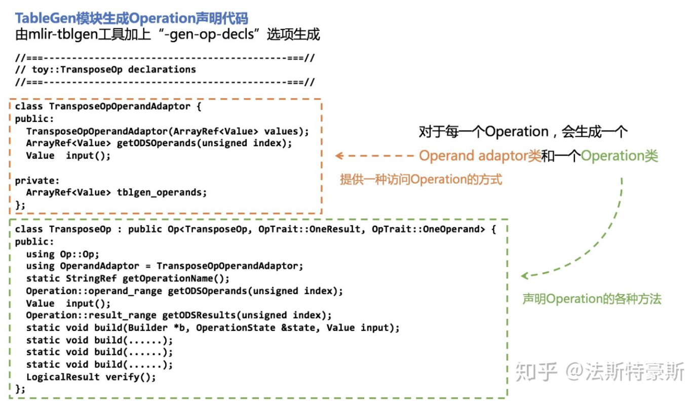
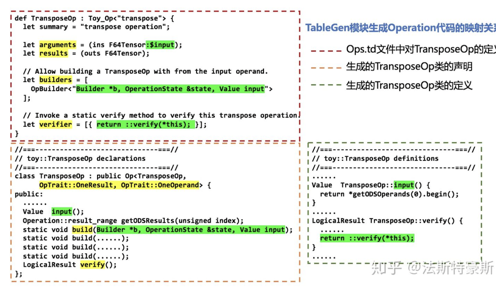

 # MLIR ODS 框架的使用示例 -- 自定义Operation
    前面的文章中讲述过TableGen模块的作用以及组成部分，整个TableGen模块分为三个部分：Dialect链接、Operation基类、自定义Operation。
    本文将会展开介绍自定义Operation部分以及TableGen模块使用的ODS框架。

回顾一下TableGen模块，通过编写.td文件，可以实现代码的自动化生成。TableGen模块在编译时会发挥作用，给Dialect模块提供支持。



整个TableGen模块是基于Operation Definition Specification (ODS)框架进行编写以及发挥作用。同时本文也将会具体分析TableGen模块中的第三部分中定义的各个字段会生成怎样的代码。

## Operation Definition Specification (ODS)框架

Operation Definition Specification (ODS) 顾名思义，就是一种Operation定义的规范，按照这样的规范来编写自定义Operation，即可使定义在编译时发挥作用，也就是说.td文件中编写的Operation定义可以扩展为等价的mlir::Op的C++代码。 这样一来，可以将Dialect的各种Operation集中发在TableGen模块中进行处理，同时也可以用来生成构建、验证、分析、打印等等的一系列有关Operation的方法和类。这也就带来了开发的单源性，促进了整个项目的自动化程度。

## 解析Operation定义中的各字段含义
下面我们还是延续之前文章中的transpose(a)函数来举例子。我们在TableGen中定义TransposeOp时，使用了summary, arguments, results, builders, verifier五个字段。

```
def TransposeOp : Toy_Op<"transpose"> {
  let summary = "transpose operation";

  let arguments = (ins F64Tensor:$input);
  let results = (outs F64Tensor);

  // Allow building a TransposeOp with from the input operand.
  let builders = [
    OpBuilder<"Builder *b, OperationState &state, Value input">
  ];

  // Invoke a static verify method to verify this transpose operation.
  let verifier = [{ return ::verify(*this); }];
}
```

其中，summary字段用来添加文档，用来简要说明Operation，此处如需对Operation进行具体说明，也可使用description字段。arguments和results字段分别用来定义Operation输入的参数和输出的结果，输入的参数是基于SSA的操作数类型，输出的结果是Operation产生的值的类型，在TransposeOp中输入参数的类型和产生数值的类型都是F64Tensor，同时$input也会生成相应的函数。builders字段用来定义build方法，此处定义的方法，在Dialect模块中进行实现，同时ODS框架在此也会自定义一些build方法，并给出相应实现。最后一个是verifier字段，在ODS框架中会自动生成验证函数，而这个字段是用来在自动生成的验证函数的后面，添加自定义的验证内容，就比如TransposeOp中的 return ::verify(*this);就会添加到验证函数末尾。



## TableGen模块生成C++代码与映射关系
在TableGen模块中编写完Operation的定义Ops.td之后，可以使用mlir-tblgen工具搭配-gen-op-decls选项生成Operation声明代码

其中，生成的TransposeOp声明代码如下所示：

```cpp
//===----------------------------------------------------------------------===//
// toy::TransposeOp declarations
//===----------------------------------------------------------------------===//

class TransposeOpOperandAdaptor {
public:
  TransposeOpOperandAdaptor(ArrayRef<Value> values);
  ArrayRef<Value> getODSOperands(unsigned index);
  Value  input();

private:
  ArrayRef<Value> tblgen_operands;
};
class TransposeOp : public Op<TransposeOp, OpTrait::OneResult, OpTrait::OneOperand> {
public:
  using Op::Op;
  using OperandAdaptor = TransposeOpOperandAdaptor;
  static StringRef getOperationName();
  Operation::operand_range getODSOperands(unsigned index);
  Value  input();
  Operation::result_range getODSResults(unsigned index);
  static void build(Builder *b, OperationState &state, Value input);
  static void build(Builder *odsBuilder, OperationState &odsState, Type resultType0, Value input);
  static void build(Builder *odsBuilder, OperationState &odsState, ArrayRef<Type> resultTypes, Value input);
  static void build(Builder *, OperationState &odsState, ArrayRef<Type> resultTypes, ValueRange operands, ArrayRef<NamedAttribute> attributes);
  LogicalResult verify();
};
```

此处我们可以把Operation声明代码分为两部分，TransposeOpOperandAdaptor声明了Operand Adaptor类，这个类提供一种访问Operation的方式，除此之外就是TransposeOp类的声明。



除此之外，我们也可以使用mlir-tblgen工具搭配-gen-op-defs选项生成Operation声明中各个成员方法的实现：

```shell
$ cd llvm-project/build
$ bin/mlir-tblgen -gen-op-defs ../mlir/examples/toy/Ch2/include/toy/Ops.td -I ../mlir/include/
```

其中生成的TransposeOp类定义如下所示：

```cpp
//===----------------------------------------------------------------------===//
// toy::TransposeOp definitions
//===----------------------------------------------------------------------===//

TransposeOpOperandAdaptor::TransposeOpOperandAdaptor(ArrayRef<Value> values) {
  tblgen_operands = values;
}

ArrayRef<Value> TransposeOpOperandAdaptor::getODSOperands(unsigned index) {
  return {std::next(tblgen_operands.begin(), index), std::next(tblgen_operands.begin(), index + 1)};
}

Value  TransposeOpOperandAdaptor::input() {
  return *getODSOperands(0).begin();
}

StringRef TransposeOp::getOperationName() {
  return "toy.transpose";
}

Operation::operand_range TransposeOp::getODSOperands(unsigned index) {
  return {std::next(getOperation()->operand_begin(), index), std::next(getOperation()->operand_begin(), index + 1)};
}

Value  TransposeOp::input() {
  return *getODSOperands(0).begin();
}

Operation::result_range TransposeOp::getODSResults(unsigned index) {
  return {std::next(getOperation()->result_begin(), index), std::next(getOperation()->result_begin(), index + 1)};
}


void TransposeOp::build(Builder *odsBuilder, OperationState &odsState, Type resultType0, Value input) {
  odsState.addOperands(input);
  odsState.addTypes(resultType0);
}

void TransposeOp::build(Builder *odsBuilder, OperationState &odsState, ArrayRef<Type> resultTypes, Value input) {
  odsState.addOperands(input);
  odsState.addTypes(resultTypes);
}

void TransposeOp::build(Builder *, OperationState &odsState, ArrayRef<Type> resultTypes, ValueRange operands, ArrayRef<NamedAttribute> attributes) {
  assert(operands.size() == 1u && "mismatched number of parameters");
  odsState.addOperands(operands);

  odsState.addAttributes(attributes);
  assert(resultTypes.size() == 1u && "mismatched number of return types");
  odsState.addTypes(resultTypes);
}

LogicalResult TransposeOp::verify() {
  {
    unsigned index = 0; (void)index;
    for (Value v : getODSOperands(0)) {
      (void)v;
      if (!(((v.getType().isa<TensorType>())) && ((v.getType().cast<ShapedType>().getElementType().isF64())))) {
        return emitOpError("operand #") << index << " must be tensor of 64-bit float values, but got " << v.getType();
      }
      ++index;
    }
  }
  {
    unsigned index = 0; (void)index;
    for (Value v : getODSResults(0)) {
      (void)v;
      if (!(((v.getType().isa<TensorType>())) && ((v.getType().cast<ShapedType>().getElementType().isF64())))) {
        return emitOpError("result #") << index << " must be tensor of 64-bit float values, but got " << v.getType();
      }
      ++index;
    }
  }
  if (this->getOperation()->getNumRegions() != 0) {
    return emitOpError("has incorrect number of regions: expected 0 but found ") << this->getOperation()->getNumRegions();
  }
  return ::verify(*this);
}

```

此处值得说明的一点是，我们在Ops.td中定义的verifier字段的内容，被添加到了LogicalResult TransposeOp::verify()函数定义的尾端，在ODS框架提供的自动化的验证的基础上，实现了自定义的验证步骤。

TransposeOp在Ops.td文件中通过各个字段来定义Operation的各个组成部分，其中arguments和results字段作用在为TransposeOp提供的参数中OpTrait::OneResult, OpTrait::OneOperand，builders字段会在Operation类声明中添加自定义的build方法，该方法将在Dialect模块中进行实现。verifier字段为TransposeOp类中的verify方法提供自定义的验证步骤，字段中给定的代码，会添加在verify方法的尾端。



本文内容参考自[MLIR官方文档](https://mlir.llvm.org/docs/OpDefinitions/)，如有错误纰漏，欢迎大家批评指正。


