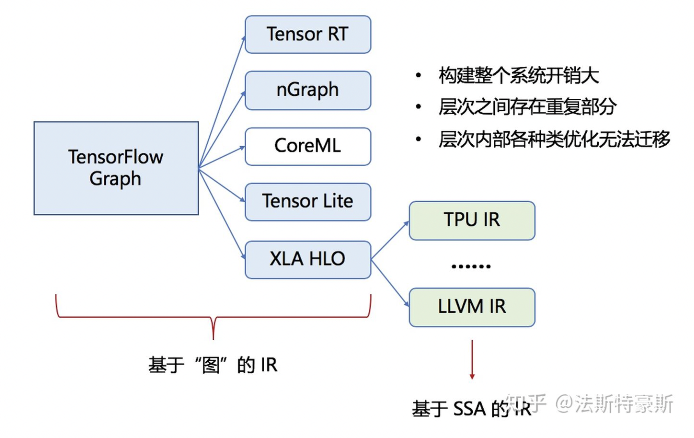

# 初见MLIR
    自从去年了解到GSoC(Google Summer of Code)，就一直非常想参加一回！考完试立刻
    开始研究游戏规则，各种开源组织在2月初就会敲定，选题也会在2月中下旬在GSoC上公
    布，届时可以开始准备proposal。然而，有些开源组织已经在自己的网站公布选题，作为
    第一次参加的小白，我也就赶紧抓住笨鸟先飞的机会！本文若有错误纰漏，欢迎大家批评指
    正！

截至目前，本次[LLVM的选题](https://llvm.org/OpenProjects.html)有关于LLVM Core的项目，还有MLIR的相关项目。简单了解之后，我还是非常愿意去尝试一下MLIR。去年听到这个名字的时候，下意识觉得这应该是个关于机器学习的中间表达结构，毕竟这年头听到ML都会认为是Machine Learning，但是MLIR还真不是Machine Learning Intermediate Representation，而是Multi-Level Intermediate Representation!

## MLIR解决什么问题？
如上文所说，MLIR中的ML不是Machine Learning，但是Machine Learning确实是是MLIR的一个应用领域。在了解MLIR是怎么工作之前，我先得弄明白这个IR在解决什么问题。

说到机器学习，我们就用TensorFlow这个框架来举例。我们知道TensorFlow是使用数据流图作为数据结构来进行各种数值计算，要让这些计算运行在硬件上，我们需要一个TensorFlow的编译生态系统：

整个编译流程先将TensorFlow的图转化为XLA HLO，即一种类似高级语言的图的中间表达形式，可以基于此进行一些High-Level的优化。接着将XLA HLO翻译为LLVM IR，使用LLVM编译到各种硬件的汇编语言，从而运行在硬件上进行数值计算。

上图的蓝色阴影部分是基于图的IR，绿色阴影部分是基于SSA的IR，然而这样的编译方式的缺点在于构建这样的编译系统的开销比较大，每一层的设计实现会有重复部分，同一个层次的IR彼此之间虽然相似，但是存在天生的“生殖隔离”，升级优化缺乏迁移性，即改变优化一个模块，并不能惠及到同层次的其他模块。因此，目前存在的问题就在于`各种IR之间转换的效率和可迁移性不高`。

对于上述问题，`MLIR希望为各种DSL提供一种中间表达形式，将他们集成为一套生态系统，使用一种一致性强的方式编译到特定硬件平台的汇编语言上`。利用这样的形式，MLIR就可以利用它模块化、可扩展的特点来解决IR之间相互配合的问题。

到此为止，我们大致知道了MLIR的诞生是为了解决什么问题。目前它对我来说还是一个黑盒子，下面的工作就是要去看看MLIR内部究竟是一个什么样的结构，看看它是怎么把各层IR整合到一起，又是如何实现扩展功能的。

本文参考自[TensorFlow XLA文档](https://www.tensorflow.org/xla)以及[MLIR Tutorial](http://www.cs.utah.edu/~mhall/mlir4hpc/pienaar-MLIR-Tutorial.pdf)，上述观点若有错误纰漏，欢迎大家批评指正！